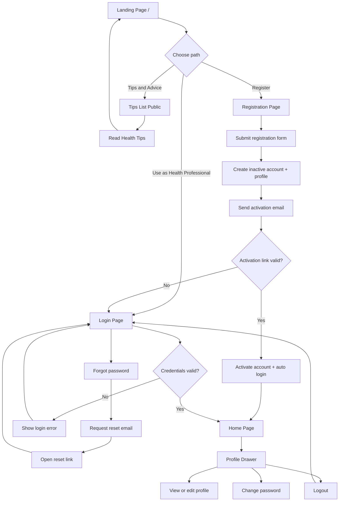
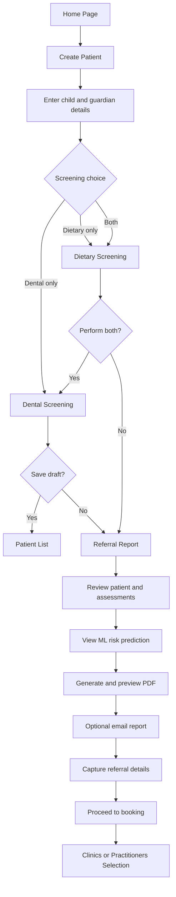
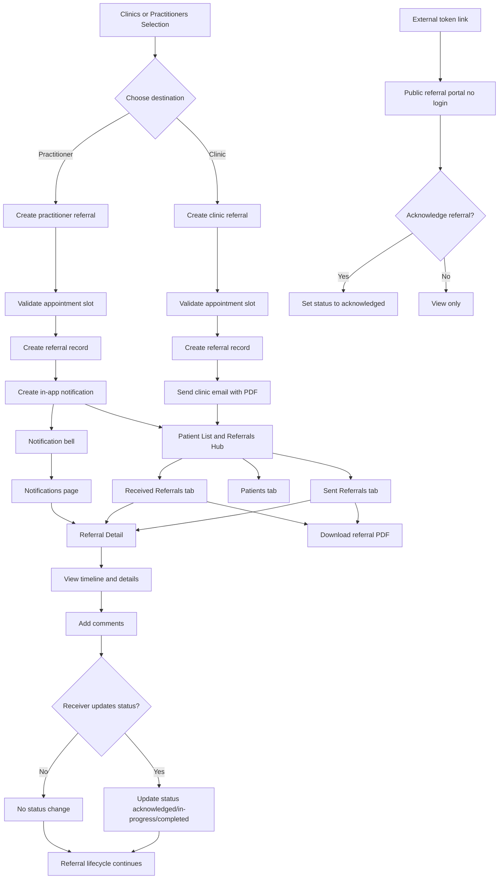

# OralSmart Mini Flowcharts

## 1) Authentication and Access Flow

```mermaid
flowchart TD
    L[Landing Page /] --> C{Choose path}
    C -->|Tips and Advice| T1[Tips List Public]
    T1 --> T2[Read Health Tips]
    T2 --> L

    C -->|Use as Health Professional| LG[Login Page]
    C -->|Register| R1[Registration Page]

    R1 --> R2[Submit registration form]
    R2 --> R3[Create inactive account + profile]
    R3 --> R4[Send activation email]
    R4 --> R5{Activation link valid?}
    R5 -->|Yes| R6[Activate account + auto login]
    R6 --> H[Home Page]
    R5 -->|No| LG

    LG --> V{Credentials valid?}
    V -->|No| E[Show login error]
    E --> LG
    V -->|Yes| H

    LG --> FP[Forgot password]
    FP --> F1[Request reset email]
    F1 --> F2[Open reset link]
    F2 --> LG

    H --> PD[Profile Drawer]
    PD --> PV[View or edit profile]
    PD --> CP[Change password]
    PD --> LO[Logout]
    LO --> LG
```

## 2) Clinical Screening and Report Flow

```mermaid
flowchart TD
    H[Home Page] --> P1[Create Patient]
    P1 --> P2[Enter child and guardian details]
    P2 --> S{Screening choice}

    S -->|Dental only| D1[Dental Screening]
    S -->|Dietary only| DI1[Dietary Screening]
    S -->|Both| DI1

    DI1 --> B{Perform both?}
    B -->|Yes| D1
    B -->|No| RPT[Referral Report]

    D1 --> D2{Save draft?}
    D2 -->|Yes| PL[Patient List]
    D2 -->|No| RPT

    RPT --> R1[Review patient and assessments]
    R1 --> R2[View ML risk prediction]
    R2 --> R3[Generate and preview PDF]
    R3 --> R4[Optional email report]
    R4 --> R5[Capture referral details]
    R5 --> R6[Proceed to booking]
    R6 --> DEST[Clinics or Practitioners Selection]
```

## 3) Referral, Notifications, and Lifecycle Flow

```mermaid
flowchart TD
    DEST[Clinics or Practitioners Selection] --> CH{Choose destination}

    CH -->|Clinic| C1[Create clinic referral]
    C1 --> C2[Validate appointment slot]
    C2 --> C3[Create referral record]
    C3 --> C4[Send clinic email with PDF]
    C4 --> HUB[Patient List and Referrals Hub]

    CH -->|Practitioner| P1[Create practitioner referral]
    P1 --> P2[Validate appointment slot]
    P2 --> P3[Create referral record]
    P3 --> P4[Create in-app notification]
    P4 --> HUB

    HUB --> S1[Sent Referrals tab]
    HUB --> R1[Received Referrals tab]
    HUB --> PT[Patients tab]

    S1 --> DTL[Referral Detail]
    R1 --> DTL

    DTL --> T1[View timeline and details]
    T1 --> T2[Add comments]
    T2 --> U{Receiver updates status?}
    U -->|Yes| U1[Update status acknowledged/in-progress/completed]
    U -->|No| U2[No status change]
    U1 --> END[Referral lifecycle continues]
    U2 --> END

    P4 --> N1[Notification bell]
    N1 --> N2[Notifications page]
    N2 --> DTL

    S1 --> PDF1[Download referral PDF]
    R1 --> PDF1

    EXT1[External token link] --> EXT2[Public referral portal no login]
    EXT2 --> EXT3{Acknowledge referral?}
    EXT3 -->|Yes| EXT4[Set status to acknowledged]
    EXT3 -->|No| EXT5[View only]
```
